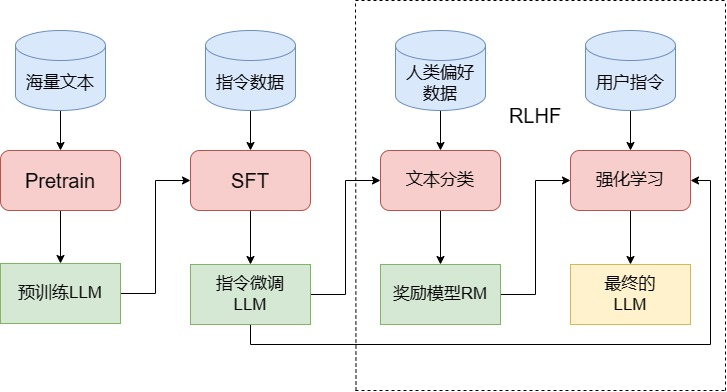

# 如何训练一个 LLM

一般来说，训练一个 LLM 需要经过三个阶段 Pretrain, SFT 和 RLHF

## Pretrain

Pretrain，即预训练，是最核心也是工程量最大的第一步。LLM 的预训练和传统预训练模型类似，都是使用海量的无监督文本对随机初始化模型参数进行训练

目前主流的 LLM 几乎都采用了 Decoder-Only 的类 GPT 架构，它们的预训练任务也沿用了 GPT 模型的经典预训练任务——因果语言模型 （Causal Language Model，CLM），即和最初的语言模型一致，通过给出上文要求模型预测下一个 token 来进行训练

同时 LLM 的一大核心特点的具有远超传统模型的参数量

| 模型       | hidden_layers | hidden_size | heads | 整体参数量 | 预训练数据量 |
| ---------- | ------------- | ----------- | ----- | ---------- | ------------ |
| BERT-base  | 12            | 768         | 12    | 0.1B       | 3B           |
| BERT-large | 24            | 1024        | 16    | 0.3B       | 3B           |
| Qwen-1.8B  | 24            | 2048        | 16    | 1.8B       | 2.2T         |
| LLaMA-7B   | 32            | 4096        | 32    | 7B         | 1T           |
| GPT-3      | 96            | 12288       | 96    | 175B       | 300B         |

LLM 的训练也往往需要更大规模的预训练语料。根据由 OpenAI 提出的 Scaling Law：C ~ 6ND，其中 C 为计算量，N 为模型参数，D 为训练的 token 数，可以实验得出训练 token 数应该是模型参数的 1.7倍

庞大的模型参数和预训练数据使得训练一个 LLM 所需的算力资源及其庞大，往往需要通过分布式框架对模型参数、训练的中间参数和训练数据进行切分。

除去算例，训练数据本身也是一个重要挑战，数据处理一般包含文档准备、语料过滤和语料去重的流程

## SFT

预训练给予了大模型知识，但是大模型此时如一个博览群书但是不求甚解的书生，能够对所有问题接出下文但是不理解问题的含义，只会死板背书。因此我们需要 **SFT（Supervised Fine-Tuning，有监督微调）**来教 LLM 如何去使用知识

对于传统模型，我们需要针对每一个下游任务单独微调。但是对于能力强大的 LLM，我们选择训练模型的“通用指令遵循能力”，也就是**指令微调**的方式来进行 SFT

所谓指令微调，即我们训练的输入是各种类型的用户指令，需要拟合的输出则是我们希望模型收到指令后做出的回复

## RLHF

