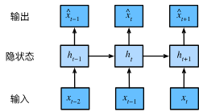

# 经典序列模型

CNN 中假设所有样本满足**独立同分布 (Independent and Identically Distributed, i.i.d.)**，即每一个样本完全独立，其取值不受其他样本影响。因此我们可以将联合概率用各样本概率乘积表示。但是对于一些序列数据，如文本、音频、气象、股价等，其关键规律来自“前后/相邻关系”，强行 i.i.d. 会丢失结构信息。因此，RNN 为序列依赖而生。

有一序列 $y_1,y_2,...,y_n$，设计模型预测位置 $t$ 的值的条件概率分布：
$$
y_{t} \sim P (y_{t} \mid y_{t - 1}, \ldots, y_{1})
$$
考虑全序列的联合概率分布，由链式法则有：
$$
\begin{align}
P(y_1, \ldots, y_T)
&= P(y_1) \cdot P(y_2|y_1) \cdot P(y_3|y_2, y_1) \cdot \ldots \cdot P(y_T|y_{T-1}, \ldots, y_1) \\
&= \prod_{t=1}^{T} P (y_{t} \mid y_{t - 1}, \ldots, y_{1}) 
\end{align}
$$

# 自回归模型和隐变量回归模型

上述的模型有一个主要问题：输入数据的数量 $t$ 会随我们遇到的数据量增加而增加直到不可接受

## 第一种策略

**自回归模型**假设 $y_t$ 仅依赖于从 $t$ 开始回溯的 $\tau$ 个时间步的值，则 $y_t$ 的条件概率可近似表示为 
$$
y_t \sim P (y_t | y_{t-1},y_{t-2},...,y_{t-\tau})
$$
直接的好处是参数总是不多的，这种模型称为自回归模型因为它们是对自己执行回归

## 第二种策略

如下图所示，保留一些对过去观测的总结 $h_t$，同时更新预测 $\hat{x_t}$ 和总结 $h_t$ 。由于 $h_t$ 从未观测到，这类模型也被称为 **隐变量回归模型**

